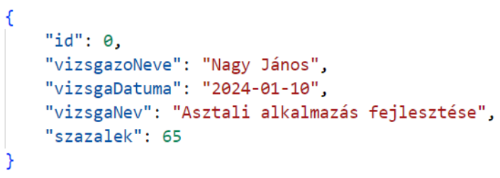
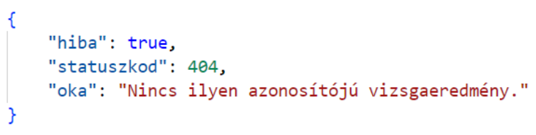

# Backend témazáró
1. Készíts egy Node.js projektet `vizsgarendszer` néven!
2. A projekt mappáján belül alakítsd ki a projekt mappastruktúráját (`src`, `public`, `src` mappán belül: `controllers` és `routes` mappák)!
3. A projekt rendelkezzen az alábbi függőségekkel: `express`, `body-parser` (ezek futtatási függőségként); `nodemon` (fejlesztői függőségként)!
4. A projekt kezdeti verziója `0.0.1`, a leírása "Vizsganyilvántartó Rendszer Backend”, a projekt belépési pontja `src` mappában az `app.js` legyen! A projekt szerzője te legyél, míg a projekt licensze "MIT" legyen!
5. Érd el, hogy a nodemon az “u” karakter hatására tudja újraindítani a projektet az “rs” karakterpár helyett!
6. A projekt rendelkezzen egy `start` nevű script-tel, amely elindítja a Node segítségével a belépési pontot! Továbbá rendelkezzen egy `dev` nevű scripttel, amely a nodemon segítségével indítja a el a belépési pontot!
7. Hozz létre egy Express.js szervert az `app.js` állományban! A szerver a localhost-on, a `24110`-es porton fogadja a HTTP kéréseket! A port száma külön konstansban legyen tárolva! Ez a konstans legyen felhasználva a szerver indításakor! A szerver a sikeres elindulásakor írja ki a “Szerver elindult a http://localhost:24110/ URL-en!” szöveget a portszám konstans felhasználásával!
8. A szerver rendelkezzen a `/` útvonalon egy GET kérést kezelő végponttal! Ez a végpont GET kérés hatására írjon ki egy üdvözlő üzenetet: “Vizsganyilvántartó Rendszer backend fut!”
9. Az `/api` végponthoz kerüljön kialakításra egy Router és egy a benne lévő végpontokhoz tartozó controllerekhez forrásállomány, bennük a megfelelő kódrészletekkel! Legyen kialakítva bennük a `/api/version` útvonalon a `GET` kérésre egy végpont, amely JSON formátumban megküldi a backend verzióját és a mai dátumot az alábbi formában:
    ```json
    {
        “current_date”: “2024.01.10”,
        “version”: “0.0.1”
    }
    ```
    Szorgalmi!: Ténylegesen a mai dátumot és a `package.json` állományban található verziót küldje!

A backend vizsgák és azok eredményeinek kezelését fogja megvalósítani. A következőkben a backend-en csak a kiírt vizsgák eredményeit kezelni képes végpontokat kell kialakítanod az alábbi leírás és 10. feladat szerint:

Vizsgaeredményt megvalósító objektum felépítésére példa:
    
    A backend a kérések során ilyen JSON objektumokat kap és küld válaszként.

A kérés feldolgozása során keletkezett hiba esetén a backend a hiba okát a következő formátumú JSON objektum küldésével valósítsa meg:
    

10. Hozd létre az alábbi végpontokat a backend szerveren az előző feladatban kialakított router-controller fájlokban! (Ha az előző feladatot nem sikerült megoldani akkor az `app.js`-ben alakítsd ki a végpontokat!)

    |       **Végpont**      | **HTTP metódus** |                                                     **Működése**                                                    |                                                              **Válaszkódok**                                                              |
    |:----------------------:|:----------------:|:-------------------------------------------------------------------------------------------------------------------:|:-----------------------------------------------------------------------------------------------------------------------------------------:|
    | `/api/vizsgaeredm`     |       `PUT`      | Egy vizsgázó vizsga eredményét képes fogadni és tárolni a szerveren.                                                | `200` - Sikeres tárolás<br>`400` - Hiányzik valamelyik adat a kapott JSON objektumból.                                                    |
    | `/api/vizsgaeredm/:id` |      `PATCH`     | Az URL paraméterben megadott azonosítójú (`id`) vizsga eredményt módosítja a kérésben érkezett JSON adatok alapján. | `200` - Sikeres tárolás<br>`400` - Hiányzik valamelyik adat a kapott JSON objektumból.<br>`404` - Nincs ilyen azonosítójú vizsgaeredmény. |
    | `/api/vizsgaeredm/:id` |     `DELETE`     | Az URL paraméterben megadott azonosítójú (`id`) vizsga eredményét törli.                                            | `200` - Sikeres törlés<br>`400` - Hiányzik valamelyik adat a kapott JSON objektumból.<br>`404` - Nincs ilyen azonosítójú vizsgaeredmény.  |
    | `/api/vizsgaeredm/:id` |       `GET`      | Az URL paraméterben megadott azonosítójú (`id`) vizsga eredményét adja vissza JSON formátumban.                     | `200` - Sikeres lekérdezés<br>`404` - Nincs ilyen azonosítójú vizsgaeredmény.                                                             |
    | `/api/vizsgaeredm`     |       `GET`      | JSON formátumban tömbben visszaadja az összes létrehozott vizsga eredményt.                                         | `200` - Sikeres lekérdezés                                                                                                                |